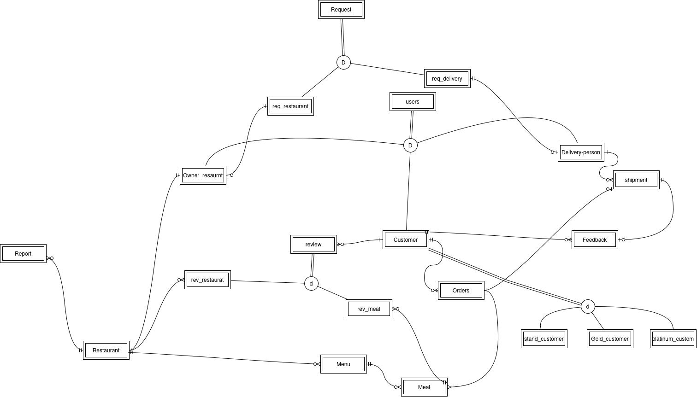

# 🍽️ Restaurant Delivery System

A full-stack web application developed as a graduation project for the Computer Science Diploma (2024/25). This system enables users to browse restaurants, place delivery orders, and manage deliveries without incorporating payment or messaging services.

## 🧱 Tech Stack

- **Frontend:** React.js
- **Backend:** NestJS (Node.js Framework)
- **Database:** MySQL

---

## 📌 Project Overview

The Restaurant Delivery System connects customers with restaurants, allowing users to:

- Browse meals by location or name
- Place delivery orders
- Track order status
- Review restaurants and meals

> ⚠️ **Note:** Payment processing, messaging, and notification services are **not included** in the current scope.


### 📊 ERD Diagram

Here’s the ERD (Entity-Relationship Diagram) representing the database structure:



> The diagram provides a clear view of the tables, their relationships, and key constraints used in the project.

---

## 👥 User Roles & Features

### 1. Customer Interface

**Features:**

- Registration, login, and profile management
- Search meals by name or location
- Add to cart, place orders, and track delivery
- View order history
- Leave reviews and feedback

**Use Cases:**

- Order a meal and track it in real-time
- Submit reviews and feedback after receiving the order

---

### 2. Admin Interface

**Features:**

- Approve/reject registrations for restaurant owners and delivery personnel
- Monitor system activity
- Generate performance and usage reports

**Use Cases:**

- Approve a restaurant owner's account
- Generate reports (e.g., top-rated meals, order trends)

---

### 3. Delivery Person Interface

**Features:**

- View available orders once meals are ready
- Accept orders and update delivery status

**Use Cases:**

- Accept an order from the delivery queue
- Update shipment status ("On the Way", "Delivered")

---

## 📦 Core Modules

| Module                | Description                                                          |
| --------------------- | -------------------------------------------------------------------- |
| **User Management**   | Handle registration, login, and profile updates for all roles        |
| **Meal Management**   | Restaurant owners create/update meals; customers browse and order    |
| **Order Management**  | Customers place and track orders; delivery personnel update statuses |
| **Review & Feedback** | Customers leave ratings and comments on meals and restaurants        |
| **Reporting**         | Admins and restaurant owners access metrics and reports              |

---

## 🚀 Installation & Setup

### Backend (NestJS)

```bash
cd backend
npm install
npm run start:dev
```

### Frontend (React)

```bash
cd frontend
npm install
npm start
```

### Database (MySQL)

- Ensure MySQL is running
- Create a database (e.g., `restaurant_delivery_db`)
- Update `.env` files for backend with DB credentials
- Run migrations/seeds if applicable

---

## 🧪 Future Improvements

- Integrate real-time notifications via WebSockets
- Add payment gateway integration
- Mobile app support (React Native or Flutter)
- Enhance reporting with visual dashboards

---

## 📚 License

This project is developed for academic purposes and not intended for commercial use.
